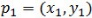
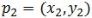
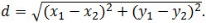
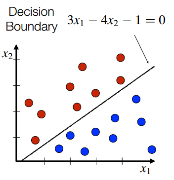

```{r setup, echo=FALSE, include=FALSE}
mypackages <- c("ggplot2", "pastecs", "plyr", "dplyr", "purrr", "stringr")
mypackages <- append(mypackages, c("readxl"))
mypackages <- append(mypackages, c("boot", "QuantPsyc"))
mypackages <- append(mypackages, c("relaimpo", "corrplot")) #, "Boruta"))
mypackages <- append(mypackages, c("car", "caret"))

mypackages

not_installed <- mypackages[!(mypackages %in% installed.packages()[, "Package"])]
if(length(not_installed)) install.packages(not_installed)

# Load libraries
##lapply(mypackages, require, character.only=TRUE)
for (package in mypackages) {
  library(package, character.only=TRUE)
}

theme_set(theme_minimal())
binwidth <- .5

workdir <- system("git rev-parse --show-toplevel", intern=TRUE)
workdir <- file.path(workdir, "week11_12")

knitr::opts_knit$set(root.dir = workdir) 


## Set the working directory
setwd(workdir)

## Load the `housing` to data
filename <- "binary-classifier-data.csv"

bd.df <- read.csv(filename)
bd.df
head(bd.df)

filename <- "trinary-classifier-data.csv"

td.df <- read.csv(filename)
td.df
head(td.df)

```

# Introduction to Machine Learning

These assignments are here to provide you with an introduction to the “Data 
Science” use for these tools. This is your future. It may seem confusing and 
weird right now but it hopefully seems far less so than earlier in the semester.
Attempt these homework assignments. You will not be graded on your answer but on
your approach. This should be a, “Where am I on learning this stuff” check. If 
you can’t get it done, please explain why.

1. Regression algorithms are used to predict numeric quantity while classification
   algorithms predict categorical outcomes. A spam filter is an example use case
   for classification algorithm. The input dataset is emails labeled as either 
   spam (i.e.junk emails) or ham (i.e. good emails). The classification algorithm
   uses features extracted from the emails to learn which emails fall into which
   category.
   
```{r regression1, echo=FALSE}
# - Fit a logistic regression model to the binary-classifier-data.csv dataset

## bd.df$label[bd.df$label > 0]

my.glm <- glm(label ~ x + y, data = bd.df, family=binomial(link="logit"))
summary(my.glm)

# - The dataset (found in binary-classifier-data.csv) contains three variables;
#   label, x, and y. The label variable is either 0 or 1 and is the output we want
#   to predict using the x and y variables.

new.df <- data.frame(label = predict(my.glm, bd.df),
                     x = bd.df$x,
                     y = bd.df$y)

summary(new.df)
```

2. In this problem, you will use the nearest neighbors algorithm to fit a model 
on two simplified datasets. The first dataset (found in binary-classifier-data.csv)
contains three variables; label, x, and y. The label variable is either 0 or 1
and is the output we want to predict using the x and y variables (You worked with
this dataset last week!). The second dataset (found in trinary-classifier-data.csv)
is similar to the first dataset except that the label variable can be 0, 1, or 2.

3. Note that in real-world datasets, your labels are usually not numbers, but text-based descriptions of the categories (e.g. spam or ham). In practice, you 
will encode categorical variables into numeric values.
   - Plot the data from each dataset using a scatter plot.
   
   - The k nearest neighbors algorithm categorizes an input value by looking at 
   the labels for the k nearest points and assigning a category based on the most
   common label. In this problem, you will determine which points are nearest by
   calculating the Euclidean distance between two points. As a refresher, the 
   Euclidean distance between two points:

     

     and

     

     is
 
     

   - Fitting a model is when you use the input data to create a predictive model.
   There are various metrics you can use to determine how well your model fits
   the data. For this problem, you will focus on a single metric, accuracy. 
   Accuracy is simply the percentage of how often the model predicts the correct
   result. If the model always predicts the correct result, it is 100% accurate. 
   If the model always predicts the incorrect result, it is 0% accurate.

   - Fit a k nearest neighbors’ model for each dataset for k=3, k=5, k=10, k=15,
   k=20, and k=25. Compute the accuracy of the resulting models for each value 
   of k. Plot the results in a graph where the x-axis is the different values of
   k and the y-axis is the accuracy of the model.



   - Looking back at the plots of the data, do you think a linear classifier 
   would work well on these datasets?

   - How does the accuracy of your logistic regression classifier from last week
   compare?  Why is the accuracy different between these two methods?


################################################################################################################################################


# NOTES:
# variance -> covariance -> corrleation -> regression
# 


#   - What is the accuracy of the logistic regression classifier?
mean(new.df$label)


test <- predict(my.glm, type="response", newdata=bd.df)
threshold <- 0.5
install.packages("e1071")

confusionMatrix(factor(test > threshold), factor(bd.df$label == 1), positive="TRUE")

## 58%

#   - Keep this assignment handy, as you will be comparing your results from this
#     week to next week.
